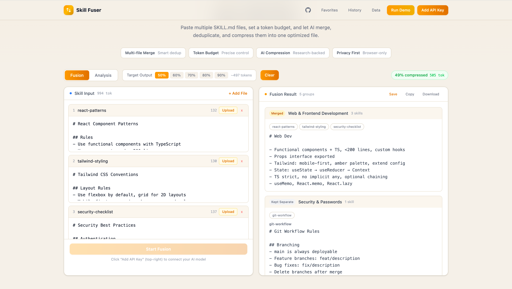
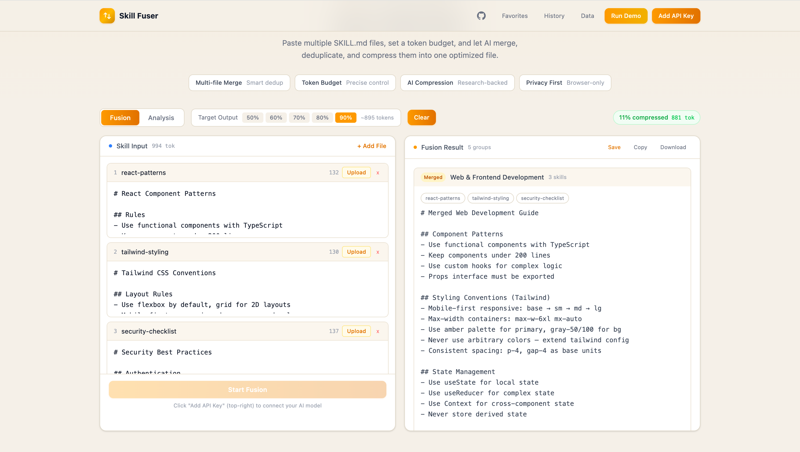
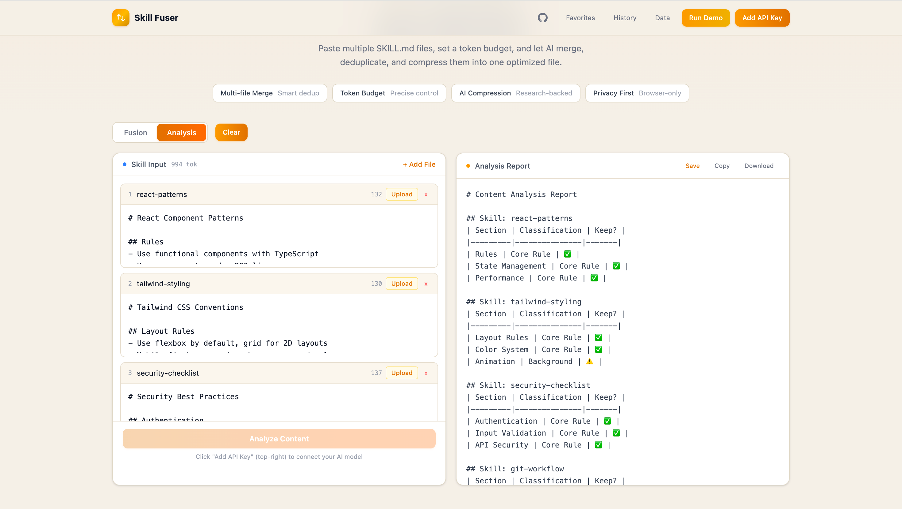

# Skill Fuser

<div align="center">

[English](#english) | [中文](./README_CN.md)

[](https://github.com/Thomaszhou22/skill-fuser/stargazers)
[](LICENSE)
[](https://skill-fuser.vercel.app)

[Live Demo](https://skill-fuser.vercel.app) | [GitHub](https://github.com/Thomaszhou22/skill-fuser) | [Research](#-research-background)

</div>

---

<a id="english"></a>

## Introduction

Skill Fuser is an AI-powered tool that merges and compresses multiple AI Agent SKILL.md files into optimized outputs. Based on the [SkillReducer](https://arxiv.org/abs/2603.29919) research paper, which found that only **38.5%** of Skill content is actionable core rules — and removing the rest actually **improves** Agent performance by **2.8%**.

## Demo

<p align="center"><b>Fusion 50% — Aggressive Compression</b><br/>Keeps only core rules, removes examples & background</p>



<p align="center"><b>Fusion 90% — Light Compression</b><br/>Preserves most details, merges duplicates only</p>



<p align="center"><b>Analysis — Content Audit</b><br/>Classifies every paragraph by importance, outputs statistics & recommended budget</p>



## How It Works

### Fusion Mode (Core Feature)

```
Upload Skills → Classify by Type → Merge Same-Type Skills → Present All Results
```

**Step 1: AI Classification**
Each uploaded Skill is classified into one of 30 categories (based on the [VoltAgent/awesome-openclaw-skills](https://github.com/VoltAgent/awesome-openclaw-skills) taxonomy):

| Category | Examples |
|----------|----------|
| Web & Frontend | React patterns, CSS conventions, accessibility |
| AI & LLMs | Prompt engineering, model selection, API usage |
| Security | OWASP checklists, auth procedures, threat models |
| DevOps & Cloud | CI/CD, deployment, Docker, monitoring |
| Git & GitHub | Branching, PR workflows, commit conventions |
| + 25 more | CLI, Data, Gaming, Health, IoT, Media... |

**Step 2: Type-Aware Merging**
- Skills of the **same category** are merged using a **category-specific prompt** (28 custom prompts total)
  - e.g., Security skills merge with "NEVER remove any security rule"
  - e.g., Web skills merge with "Unify component patterns, keep the most robust version"
- Skills in categories not suited for merging are **kept as-is**
- Budget is split equally across mergeable groups

**Step 3: Grouped Results**
Results are presented in collapsible groups:
- **Merged groups** — show merged output with skill names
- **Kept Separate** — show original content for standalone skills

### Analysis Mode

Upload Skills → AI classifies every paragraph by importance (Core Rule / Background / Example / Template / Redundant) → outputs statistics report with recommended token budget

## Core Features

- **30 Skill Categories** — classification based on VoltAgent/awesome-openclaw-skills taxonomy
- **28 Custom Merge Prompts** — each category has a specialized prompt for higher quality merges
- **Unknown Category Detection** — if AI returns an unrecognized type, it's reported to the user and kept separate
- **Token Budget Control** — set output limit, budget auto-split across merge groups
- **Multi-model Support** — OpenAI, Anthropic, Google Gemini, DeepSeek, custom endpoints
- **Privacy First** — pure frontend, all data stays in your browser, no backend
- **History & Favorites** — save, search, and revisit past fusion results
- **Data Management** — export/import all data as JSON backup

## Quick Start

### Use Online (Recommended)

Visit: **[https://skill-fuser.vercel.app](https://skill-fuser.vercel.app)** — no signup, no install.

### How to Use

1. Click **"Add API Key"** (top right) → select AI provider → enter API Key
2. Paste Skill content or upload `.md` files in the left panel
3. Set **Target Output** token budget
4. Click **"Start Fusion"**
5. Review grouped results — copy or download

### Self-Deploy

[](https://vercel.com/new/clone?repository-url=https://github.com/Thomaszhou22/skill-fuser)

```bash
git clone https://github.com/Thomaszhou22/skill-fuser.git
cd skill-fuser
npm install
npm run dev    # Development
npm run build  # Production
```

## Supported AI Models

| Provider | Default Model | Notes |
|----------|--------------|-------|
| OpenAI | gpt-4o-mini | gpt-4o, gpt-4.1 series |
| Anthropic | claude-sonnet-4 | Sonnet/Haiku |
| Google Gemini | gemini-2.0-flash | Flash/Pro series |
| DeepSeek | deepseek-chat | Auto-configured |
| Custom | — | Any OpenAI-compatible endpoint |

> **Recommended**: Gemini Flash or GPT-4o-mini — fast, cheap, good enough.

## Research Background

Based on [SkillReducer: Optimizing LLM Agent Skills for Token Efficiency](https://arxiv.org/abs/2603.29919):

| Finding | Data |
|---------|------|
| Core rules in Skill files | Only 38.5% |
| Agent performance after removing non-essential content | **+2.8%** |
| Max compression ratio (lossless) | 60%+ |

**5-Level Classification**: Core Rule → Background → Example → Template → Redundant

**Compression Pipeline**: Classify → Deduplicate → Compress → Progressive Disclosure

## Tech Stack

React 19 + TypeScript + Tailwind CSS v4 + Vite 6 + Vercel

## License

This project is licensed under the [GNU Affero General Public License v3.0](LICENSE).

In simple terms: You can freely use, study, and modify this project. However, if you distribute a modified version (including as a network service), you **must** also release your source code under AGPL-3.0.

What you can do:
- ✅ Personal use, learning, and research
- ✅ Modify and adapt for any purpose
- ✅ Use as a network service

What you must do:
- 📋 If you distribute or offer it as a network service, release your modified source code under AGPL-3.0
- 📝 Include the original copyright notice and license text

Core principle: Share alike — if you improve it, share your improvements with the community.
